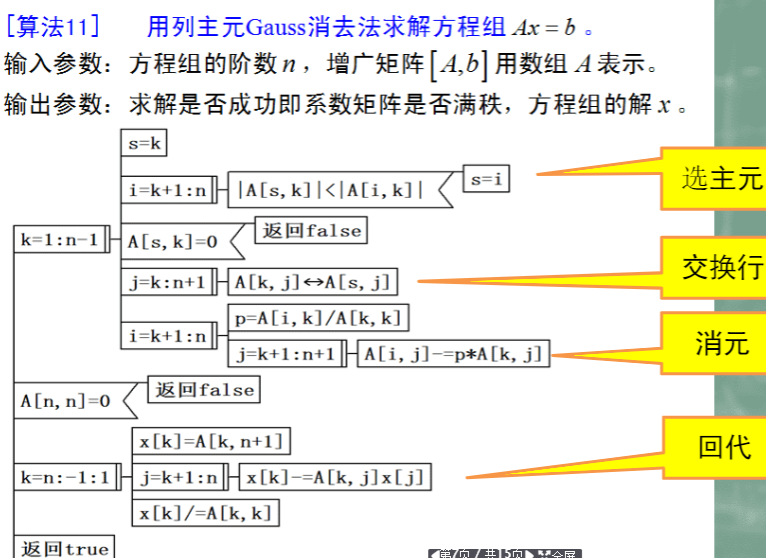

# Matlab
### Matlab Algorithms
### Matlab ھېساپلاش  ماتىماتىكىسى ئالگورىزىملىرى
MATLAB is a commercial mathematics software produced by MathWorks in the United States. It is used in data analysis, wireless communication, deep learning, image processing and computer vision, signal processing, quantitative finance and risk management, robotics, control systems and other fields. [1] 
MATLAB is a combination of two words matrix&laboratory, which means matrix factory (matrix laboratory). The software mainly faces the high-tech computing environment of scientific computing, visualization and interactive programming. It integrates many powerful functions such as numerical analysis, matrix calculation, scientific data visualization, and nonlinear dynamic system modeling and simulation in an easy-to-use window environment. It is used for scientific research, engineering design, and many sciences that require effective numerical calculations. The field provides a comprehensive solution, and to a large extent get rid of the editing mode of traditional non-interactive programming languages ​​(such as C, Fortran). [1] 
MATLAB, Mathematica, and Maple are collectively called the three major mathematical software. It is second to none in numerical calculation in mathematical science and technology application software. MATLAB can perform matrix operations, plot functions and data, implement algorithms, create user interfaces, connect programs in other programming languages, etc. The basic data unit of MATLAB is a matrix. Its instruction expressions are very similar to those commonly used in mathematics and engineering. Therefore, it is much simpler to use MATLAB to solve problems than to use C, FORTRAN and other languages ​​to accomplish the same thing, and MATLAB also Absorb the advantages of software like Maple, making MATLAB a powerful mathematical software. In the new version, support for C, FORTRAN, C++, and JAVA has also been added.

<div dir="rtl">
MATLAB ئامېرىكىدىكى MathWorks ئىشلەپچىقارغان سودا ماتېماتىكا يۇمشاق دېتالى بولۇپ ، ئۇ سانلىق مەلۇمات ئانالىزى ، سىمسىز خەۋەرلىشىش ، چوڭقۇر ئۆگىنىش ، رەسىم بىر تەرەپ قىلىش ۋە كومپيۇتېر كۆرۈش ، سىگنال بىر تەرەپ قىلىش ، مىقدار مالىيە ۋە خەتەرنى باشقۇرۇش ، ماشىنا ئادەم ، كونترول سىستېمىسى ۋە باشقا ساھەلەردە ئىشلىتىلىدۇ. [1]
MATLAB ماترىسسا ۋە تەجرىبىخانىدىن ئىبارەت ئىككى سۆزنىڭ بىرىكىشى بولۇپ ، ماترىسسا زاۋۇتى (ماترىسسا تەجرىبىخانىسى) نى كۆرسىتىدۇ. بۇ يۇمشاق دېتال ئاساسلىقى ئىلمىي ھېسابلاش ، تەسۋىرلەش ۋە ئۆز-ئارا پروگرامما تۈزۈشنىڭ يۇقىرى تېخنىكىلىق ھېسابلاش مۇھىتىغا دۇچ كېلىدۇ. ئۇ سانلىق مەلۇماتلارنى ئانالىز قىلىش ، ماترىسسا ھېسابلاش ، ئىلمىي سانلىق مەلۇماتلارنى تەسۋىرلەش ۋە سىزىقسىز ھەرىكەتچان سىستېما مودېل ۋە تەقلىد قىلىش قاتارلىق نۇرغۇن كۈچلۈك ئىقتىدارلارنى بىرلەشتۈرگەن بولۇپ ، ئىشلىتىشكە قولايلىق بولغان كۆزنەك مۇھىتىدا ئۇ ئىلمىي تەتقىقات ، قۇرۇلۇش لايىھىلەش ۋە ئۈنۈملۈك سان ھېسابلاشنى تەلەپ قىلىدىغان نۇرغۇن ئىلىملەرگە ئىشلىتىلىدۇ. بۇ ساھە ئەتراپلىق ھەل قىلىش چارىسى بىلەن تەمىنلەيدۇ ، ھەمدە ئەنئەنىۋى ئۆز-ئارا تەسىر كۆرسىتەلمەيدىغان پروگرامما تىللىرىنىڭ (C ، Fortran غا ئوخشاش) تەھرىرلەش ھالىتىدىن زور دەرىجىدە قۇتۇلىدۇ. [1]
MATLAB ، ماتېماتىكا ۋە Maple ئۈچ چوڭ ماتېماتىكىلىق يۇمشاق دېتال دەپ ئاتىلىدۇ. ئۇ ماتېماتىكا ئىلمى ۋە تېخنىكا قوللىنىش يۇمشاق دېتالىدىكى سان ھېسابلاشتا ئىككىنچى ئورۇندا تۇرىدۇ. MATLAB ماترىساس مەشغۇلاتى ، سىيۇژىت فۇنكسىيەسى ۋە سانلىق مەلۇماتلارنى ئىجرا قىلالايدۇ ، ھېسابلاش ئۇسۇلىنى يولغا قويالايدۇ ، ئىشلەتكۈچى ئارايۈزىنى قۇرالايدۇ ، باشقا پروگرامما تىلىدىكى پروگراممىلارنى ئۇلىيالايدۇ. MATLAB نىڭ ئاساسلىق سانلىق مەلۇمات بىرلىكى ماترىساس بولۇپ ، ئۇنىڭ كۆرسەتمە ئىپادىلىرى ماتېماتىكا ۋە قۇرۇلۇشتا كۆپ قوللىنىلىدىغان سۆزلەر بىلەن ناھايىتى ئوخشايدۇ. شۇڭلاشقا ، MATLAB نى ئىشلىتىپ مەسىلىنى ھەل قىلىشتا C ، FORTRAN ۋە باشقا تىللارنى ئىشلىتىپ ، ئوخشاش ئىشنى ئەمەلگە ئاشۇرۇش تېخىمۇ ئاددىي ، MATLAB مۇ Maple غا ئوخشاش يۇمشاق دېتاللارنىڭ ئەۋزەللىكىنى ئەمەلدىن قالدۇرۇپ ، MATLAB نى كۈچلۈك ماتېماتىكىلىق يۇمشاق دېتالغا ئايلاندۇردى. يېڭى نەشرىدە C ، FORTRAN ، C ++ ۋە JAVA نى قوللاشمۇ قوشۇلدى
</div>

#### مەن بۇ يەردە ئۆزۈم تەييارلىغان ھېساپلاش ماتىماتىكىسىدا كۆپ ئىشلىتىلىدىغان ئىلمىي ھېساپلاش ئۇسۇللىرىنىڭ مەتلەب كودىنى ھەمبەھېرلەيمەن

#### Files descriptionكود ھۆججەتلىرى ھەققىدە

# 《数值计算方法》基本算法

>   [1.连加、连乘积	3](#_Toc42267191)

>   [2.二分法（非线性方程）	3](#_Toc42267192)

>   [3.一般迭代法（非线性方程）	4](#_Toc42267193)

>   [4.Newton法（非线性方程）	4](#_Toc42267194)

>   [5.割线法	5](#_Toc42267195)

>   [6.Steffensen加速	6](#_Toc42267196)

>   [7.LU分解	7](#_Toc42267197)

>   [8.列主元Gauss消去法	8](#_Toc42267198)

>   [9.平方根方法（Cholesky分解）	9](#_Toc42267199)

>   [10.\*改进的平方根方法	10](#_Toc42267200)

>   [11.Largrange插值法	11](#_Toc42267201)

>   [12.Newton插值法	13](#_Toc42267202)

>   [13.Runge现象	14](#_Toc42267203)

>   [14.线性最小二乘拟合	15](#_Toc42267204)

>   [15.可化为线性拟合的非线性参数拟合	16](#_Toc42267205)

>   [16.复化梯形求积法	18](#_Toc42267206)

>   [17.复化抛物形（Simpson）求积法	18](#_Toc42267207)

>   [18.自适应复化梯形求积法	19](#_Toc42267208)

>   [19.Romberg算法	19](#_Toc42267209)

>   [20.解线性方程组的Jacobi迭代法	20](#_Toc42267210)

>   [21.解线性方程组的Gauss-Seidel迭代法	21](#_Toc42267211)

>   [22.解线性方程组的SOR迭代法	22](#_Toc42267212)

>   [23.解线性方程组的最速下降法	23](#_Toc42267213)

>   [24.解线性方程组的共轭梯度法	24](#_Toc42267214)

>   [25.解非线性方程组的Newton法	25](#_Toc42267215)

>   [26.Givens变换	25](#_Toc42267216)

>   [27.Householder变换	26](#_Toc42267217)

>   [28.幂法求按模最大的特征值	28](#_Toc42267218)

>   [29.反幂法求按模最小的特征值	29](#_Toc42267219)

>   [30.带位移的幂法	30](#_Toc42267220)

>   [31.带位移的反幂法	30](#_Toc42267221)

>   [32.\*求对称矩阵特征值的Jacobi方法	31](#_Toc42267222)

>   [33.求矩阵特征值的基本的QR迭代法	32](#_Toc42267223)

>   [34.求常微分方程初值问题的向前Euler法	34](#_Toc42267224)

>   [35.求常微分方程初值问题的向后Euler法	34](#_Toc42267225)

>   [36.求常微分方程初值问题的改进Euler法	34](#_Toc42267226)

>   [37.求常微分方程初值问题的四级四阶Runge-Kuttah法	34](#_Toc42267227)

>   [38.求二阶常微分方程初值问题的改进Euler法	34](#_Toc42267228)

>   [39.求常微分方程组初值问题的改进Euer法	34](#_Toc42267229)

>   [40.\*解非线性方程组的Broyden方法	35](#_Toc42267230)

>   [41.\*求常微分方程初值问题的Adams预校法	35](#_Toc42267231)

>   [42.\*三次样条插值法	35](#_Toc42267232)

>   [试编写求解上三角形方程组的前代法的函数子程序，并用之求解线性方程组：	36](#_Toc42267233)

>   [试编写求解上三角形方程组的前代法的函数子程序并随机产生一个100阶	36](#_Toc42267234)

>   [试编写求解下三角形方程组的前代法函数子程序，并用之求解线性方程组：	36](#_Toc42267235)

>   [试编写求解下三角形方程组的前代法的函数子程序并随机产生一个100阶	37](#_Toc42267236)

>   [用高斯（Gauss）消去法求解线性方程组的解。写高斯（Gauss）消去法函数子程序	37](#_Toc42267237)

>   [用追赶法求解下列三对角线性方程组的解（）	38](#_Toc42267238)

## 1.连加、连乘积  
连加  
```matlab
clc,clear
n = 5;%n个数相加
u = rand(1,n);y=0;
for j=1:n
    y = y+u(j);
end
y
```
连乘积  
```matlab
clc,clear
n = 5;%n个数连乘
u = rand(1,n);
y=1;
for j=1:n
    y = y*u(j);
end
y
```
## 2.二分法（非线性方程）


>   **最大迭代次数：区间 [a,b],误差TOL ,迭代次数k,**

求在[0,1]内的根。绝对误差限0.001

主函数   
```matlab
clc,clear
a = 0;b = 1;k = 0;TOL=10^(-3);
N=1000;
x = (a+b)/2;
y = fun(x);
while abs(y) > TOL && k < 1000
    k = k + 1;
    if y*fun(a) < 0
        b = x;
    else
        a = x;
    end
    x = (a+b)/2;
    y = fun(x);
end
x,k
```
函数f(x)的m文件  
```matlab
function y = fun(x)
    y = exp(x)+10*x-2;
end
```

## 3.一般迭代法（非线性方程）


>   求在[0,1]内的根。绝对误差限0.001

>   迭代格式：

主函数   
```matlab
clc;
clear;
k = 1;N=1000;TOL=10^(-3);
x0 = 0;
x = fun(x0);
cmp = x-x0;
while abs(cmp) > TOL && k < N
   cmp = x-x0;
   k = k + 1;
   x0 = x;
   x = fun(x0);
end
x,k
%x很大时，灰色判断部分可以为
%abs((x-x0)/x) < TOL
```
函数f(x)的m文件   
```matlab
function y = fun(x)
    y = (2-exp(x))/10;
end
```

## 4.Newton法（非线性方程）

>   **迭代格式：。不低于二阶收敛，且依赖初始点取值。**

>   求在[0,1]内的根。绝对误差限0.001

>   迭代格式： ，本题初始点取

主函数   
```matlab
clc;
clear;
k = 1;N=1000;TOL=10^(-4);
x0 = 0;x1 = 0;cm = N;
while abs(cm)>TOL && k < N
    k = k +1;
    [y,dy] = fun(x0);
    x1 = x0 - y/dy;
    cm = x1-x0;
    x0 = x1;
end
x1,k
```
函数f(x)的m文件   
```matlab
function [y,dy] = fun(x)
    y = exp(x)+10*x-2;
    dy = exp(x)+10;
end
```

## 5.割线法


>   求在[0,1]内的根。绝对误差限0.001

迭代格式： ，本题初始点取

主函数   
```matlab
clc,clear  %主函数
k = 1;N=1000;TOL=10^(-4);
x0=0;x1=1;x2=0;cm = N;
while abs(cm)>TOL && k < N
    k = k +1;
    y0 = fun(x0);
    y1 = fun(x1);
    x2 = x1 - (y1*(x1-x0))/(y1-y0);
    cm = x1-x0;
    x0 = x1;
    x1 = x2;
end
x2,k
```
函数f(x)的m文件   
```matlab
function y = fun(x)
    y = exp(x)+10*x-2;
end
```  
## 6.Steffensen加速


>   求在[0,1]内的根。绝对误差限0.001

迭代格式： ，本题初始点取

主函数   
```matlab
clc;
clear;
k = 1;N=1000;TOL=10^(-4);
x0=0.5;cm = N;
while abs(cm)>TOL && k < N
    k = k +1;
    y = fun(x0);
    x1 = x0 - ((y-x0)^2)/(fun(y)-2*y+x0);
    cm = x1-x0;
    x0 = x1;
end
x0,k
```
函数f(x)的m文件  
```matlab
function y = fun(x)
    y = (2-exp(x))/10;
end
```
## 7.LU分解


矩阵的 LU 分解  
```matlab
clc,clear
A = [1,4,7;2,5,8;3,6,10];
[n,m] = size(A);
for k=1:n-1
    for i=k+1:n
        A(i,k) = A(i,k)/A(k,k);
        for j=k+1:n
            A(i,j) = A(i,j)-A(i,k)*A(k,j);
        end
    end
end
U = triu(A);
A(logical(eye(size(A))))=1;
L = tril(A);
L,U
```
1.默认矩阵A可以输入。 2.矩阵A的对角元均为不为0是，算法才能用。 3.定理：矩阵A的1:n-1顺序主子式非奇异，则对角元均不为0，此时也存在唯一的LU分解.  

## 8.列主元Gauss消去法




列主元Gauss消去法   
```matlab
clc;
clear;
%列主元Gasuss消去法
%要求主元不能为0
A = [1,4,7;2,5,8;3,6,10];%系数矩阵
b = [11,12,13]';%右端项
a=A;
A = [A,b];%增广矩阵，1~n-1顺序主子式非零
[n,m] = size(A);
x = zeros(n,1);
for k=1:n-1
    s = k;
    for i=k+1:n
        if abs(A(s,k))<abs(A(i,k))
            s = i;
        end
    end
    for j=k:n+1
        t = A(s,j);
        A(s,j) = A(k,j);
        A(k,j) = t;
    end
    for i=k+1:n
        p = A(i,k)/A(k,k);
        for j=k+1:n+1
            A(i,j) = A(i,j)-p*A(k,j);
        end
    end
    for k=n:-1:1
        x(k) = A(k,n+1);
        for j=k+1:n
            x(k) = x(k)-A(k,j)*x(j);
        end
        x(k) = x(k)/A(k,k);
    end
end
A,x
```

## 9.平方根方法（Cholesky分解）


平方根方法（Cholesky分解）输出平方根因子  
```matlab
clc;
clear;
%平方根法（Cholesky分解）
A = [4,1,2;1,5,3;2,3,6];
[n,n]=size(A);
for k=1:n
    for p=1:k-1
        A(k,k) = A(k,k)-A(k,p)^2;
    end
    A(k,k) = sqrt(A(k,k));
    for i=k+1:n
        for p=1:k-1
            A(i,k) = A(i,k)-A(i,p)*A(k,p);
        end
        A(i,k) = A(i,k)/A(k,k);
    end
end
L = tril(A);
L
```  
## 10.\*改进的平方根方法


改进的平方根法  
```matlab
clc;
clear;
%改进的平方根法
A = [4,1,2;1,5,3;2,3,6];
[n,n]=size(A);
for j=1:n
    v = 0;
    for k=1:j-1
        v = v+A(k,k)*A(j,k)*A(j,k);
    end
    A(j,j) = A(j,j)-v;
    for i=j+1:n
        t = 0;
        for k=1:j-1
            t = t+A(k,k)*A(j,k)*A(i,k);
        end
        A(i,j) = (A(i,j)-t)/A(j,j);
    end
end
D = diag(diag(A));
A(logical(eye(size(A))))=1;
L = tril(A);
L,D
```  

## 11.Largrange插值法


主函数文件  
```matlab
clc;
clear;
xx = [0,1,2,3,4,5,6];%x 值
yy = [0,1,4,9,16,25,36];
%x值对应的函数值
syms x
%构造拉格朗日函数
L = fun(xx,yy,x);
L = expand(L);%展开
L
%构造函数句柄
L = matlabFunction(L);
```
函数fun文件  
```matlab
function y = fun(xx,yy,x)
    n = length(xx);
    y = 0;
    for j=1:n
        u = 1.0;
        for k=1:n
            if k~=j
                u = u*(x-xx(k))/(xx(j)-xx(k));
            end
        end
        y = y+u*yy(j);
    end
end
```  
## 12.Newton插值法


主函数文件  
```matlab
clc;
clear;
X = [0,1,2,3,4,5,6];%x 值
Y = [0,1,4,9,16,25,36];
%x值对应的函数值
[A,N] = fun(X,Y);
%构造牛顿插值函数
A %差商表
N %牛顿插值函数
N = matlabFunction(N);
```
函数fun文件  
```matlab
function [A y] = fun(X,Y)
    n = length(X);
    A = zeros(n);A(:,1)=X;A(:,2)=Y;
    for j=3:n+1
        for i=j-1:n
            A(i,j) = (A(i,j-1)-A(i-1,j-1))/(X(i)-X(i+2-j));
        end
    end
    syms x f
    f = 0;
    for i=1:n
        u = 1.0;
        for k=1:i-1
            u = u*(x-X(k));
        end
        f = f+u*A(i,i+1);
    end
    y = expand(f);
end
```
## 13.Runge现象


## 14.线性最小二乘拟合

| x=[1 2 3 4 5 6 7 8 9]; y=[9 7 6 3 -1 2 5 7 20]; p=polyfit(x,y,3);%3 xi=0:2:10 yi=polyval(p,xi); plot(xi,yi,x,y,'r\*'); %(x,y)是需要拟合的点的横纵坐标，3是多项式最大次数                                                                                                                                                                                                                             | 直接利用多项式拟合函数 polyfit(x,y,3);%3是最大次幂，polyfit是多项式的个个系数 xi;%为了画图显示的范围，可根据数据范围自行调整。 yin%计算多项式的值 |
|------------------------------------------------------------------------------------------------------------------------------------------------------------------------------------------------------------------------------------------------------------------------------------------------------------------------------------------------------------------------------------------------------|---------------------------------------------------------------------------------------------------------------------------------------------------|
| clc,clear x = [0,1,2,3,4,5,6,7,8]; y = [1,3,5,7,9,11,13,15,17]; xp = mean(x);xxp = mean(x.\^2); yp = mean(y);xyp = mean(x.\*y); b = (xyp-xp\*yp)/(xxp-xp\^2); a = yp - b\*xp; Y = \@(X) a+b\*X; %上述方法是二维线性拟合。 完全可以推广到n维线性拟合 如 fi = a0+a1x1i+a2x2i…+anxni 系数 (a0,a1,a2,…,an) 函数值fi (i=1,2,..n) 自变量矩阵 (x1i,x2i,x3i,..xni) (i=1,2,…n) 拟合函数 y=a0+a1x1+a2x2+…+anxn | [media/269bb7faffb251d0a959f0f927f7a7f1.png](media/269bb7faffb251d0a959f0f927f7a7f1.png)                                                          |

## 15.可化为线性拟合的非线性参数拟合

对于某些非线性函数，如指数函数y=e\^(ax+b)，也可以对函数转化后，求得精确的拟合结果，如上述指数函数可转化为x=(ln
y)/a
-b/a，同样可以求得具有全局最优拟合误差的拟合函数。上述函数都可以用MATLAB的regress函数或者polyfit函数求得最优的拟合结果，或者可以用广义逆矩阵的最小二乘解计算而得。但是，对于大多数非线性函数，难以求得拟合误差全局最优的拟合结果，形如y=c1\*e\^(px)+c2\*e\^(qx)。这一类函数，一般做法是首先预估拟合函数的参数，以此作为初始值，采用迭代优化的方法求出局部最优的拟合参数。

对于大多数指数函数、三角函数、多项式函数通过四则运算或者复合得到的函数，通常可以用线性微分方程来表示，形如y''+ay'+by=0的常系数线性微分方程则可以表示以下形式的函数：

①y=C1\*e\^(p\*x)+C2\*e\^(q\*x)；

②y=C1\*（1+C2\*x）\*e\^(w\*x)；

③y=e\^(p\*x)\*（C1\*sin (w\*x)+C2\*cos (w\*x)）。

对于上述非线性函数，则可以通过拟合线性微分方程的系数，再计算出对应的非线性函数的参数，并利用样本数据作为初始条件，拟合出函数中的其他常数项。微分方程需要转化为差分方程：

①y'(n)=(y(n+1)-y(n-1))/(x(n+1)-x(n-1))；

②y''(n)=(y(n+1)-2\*y(n)+y(n-1))/((x(n+1)-x(n-1))/2)\^2。

通过拟合方程y''+ay'+by=0则可得到a和b，再通过求解二次方程r\^2+a\*r+b=0，得到两个解r1和r2。

当r1和r2不相等时，则可得到函数y=C1\*e\^(r1\*x)+C2\*e\^(r2\*x)，再利用样本数据线性拟合则可得到C1和C2。

当r1=r2时，可得到函数y=C1\*e\^(r1x)+C2\*x\*e\^(r1x)，再利用样本数据线性拟合则可得到C1和C2。

当r1和r2为共轭复数时，可得函数y=e\^(a\*x)\*（C1\*sin (b\*x)+C2\*cos
(b\*x)），其中a和b分别为r1的实部和虚部，再利用样本数据线性拟合则可得到C1和C2。

实例：
```matlab
clc,clear
% 产生样本数据
x = linspace(0,98,50)';
y = 0.9*exp(-0.2*x)-0.3*exp(-0.06*x)+10.57;
plot(x,y)
% 计算差分
dyx = (y(3:end) - y(1:end-2))./(x(3:end) - x(1:end-2));
ddyx = (y(3:end) - 2*y(2:end-1) + y(1:end-2))./(x(3:end) - x(1:end-2)).^2*4;
% 拟合微分方程系数
A = [dyx,y(2:end-1),-1*ones(length(dyx),1)];
b = -ddyx;
a = (A.'*A)\A.'*b;
a(3) = a(3)/a(2);
% 求解二次方程
syms r
r0 = double(solve(r^2+a(1)*r+a(2)))
% 线性拟合得到常数项C1,C2
A = [exp(r0(1)*x),exp(r0(2)*x)];
C = (A.'*A)\A.'*(y-a(3))
% 作图
hold on
plot(x,C(1)*exp(r0(1)*x)+C(2)*exp(r0(2)*x)+a(3),'r*')
最后，还可以用lsqcurvefit函数进一步优化拟合结果，采用上述方法得到的参数作为初始点，可以修正差分方程拟合导致的误差。
f = @(b,x)b(1)*exp(b(2)*x)+b(3)*exp(b(4)*x)+b(5);
b0 = [C(1);r0(1);C(2);r0(2);a(3)];
b1 = lsqcurvefit(f,b0,x,y)
hold on
plot(x,f(b1,x),'k.')
```

## 16.复化梯形求积法


## 17.复化梯形、抛物形（Simpson）求积法


## 18.自适应复化梯形求积法


## 19.Romberg算法


## 20.解线性方程组的Jacobi迭代法


```matlab
clc,clear
A=[10,3,1;2,-10,3;1,3,10];
b=[14,-5,14]';
n = length(b);
D=diag(diag(A));
L=-tril(A,-1);U=-triu(A,1);
D=D\^(-1);
x=zeros(n,1);k=0;
while norm(b-A\*x)\>10\^(-7) && k \< 1000
k = k +1;
x = (D\*(L+U))\*x+D\*b;
end
x=x;k=k;
x
```
## 21.解线性方程组的Gauss-Seidel迭代法


```matlab
clc,clear
A=[10,3,1;2,-10,3;1,3,10];
b=[14,-5,14]';
n = length(b);
D=diag(diag(A));
L=-tril(A,-1);U=-triu(A,1);
D=D^(-1);T=(eye(n)-D*L)^(-1);
M=T*D*U;g=T*D*b;
x=zeros(n,1);k=0;
while norm(b-A*x)>10^(-7) && k < 1000
    k = k +1;
    x = M*x+g;
end
x
```

## 22.解线性方程组的SOR迭代法


```matlab
clc,clear
A=[10,3,1;2,-10,3;1,3,10];
b=[14,-5,14]';
n = length(b);
D=diag(diag(A));
L=-tril(A,-1);U=-triu(A,1);
x=zeros(n,1);k=0;w=1.25;
while norm(b-A*x)>10^(-7) && k < 1000
    k = k +1;
    x = (D-w*L)\(((1-w)*D+w*U)*x+w*b);
    x'
end
x=x;k=k;
x
```

## 23.解线性方程组的最速下降法


```matlab
clc,clear
n=3;
A=hilb(n);b=sum(A')';
x=zeros(n,1);k=0;
r=b-A*x;
while norm(r,1)>10^(-7) && k < 10000
    k = k +1;
    alp = (r'*r)/(r'*A*r);
    x=x+alp*r;
    r=b-A*x;
end
x=x;k=k;
x
```

## 24.解线性方程组的共轭梯度法


```matlab
clc,clear
n=4;
A=hilb(n);b=sum(A')';
x=zeros(n,1);k=0;
r=b-A*x;rho=r'*r;
while rho >10^(-20) && k < 10000
    k = k +1;
    if k==1
        p=r;
    else
        bt=rho/rho1;
        p=r+bt*p;
    end
    w=A*p;alp=rho/(p'*w);
    x=x+alp*p;
    r=r-alp*w;rho1=rho;
    rho=r'*r;
    x'
end
x=x;k=k;
x
```

## 25.解非线性方程组的Newton法


## 26.Givens变换


基于Givens变换的QR分解   
```matlab
function [Q,R] = qrgivens(A)
  [m,n] = size(A);
  Q = eye(m);
  R = A;
  for j = 1:n
    for i = m:-1:(j+1)
      G = eye(m);
      [c,s] = givensrotation( R(i-1,j),R(i,j) );
      G([i-1, i],[i-1, i]) = [c -s; s c];
      R = G'*R;
      Q = Q*G;
    end
  end
end
```
OR
```matlab
function [c,s] = givensrotation(a,b)
  if b == 0
    c = 1;
    s = 0;
  else
    if abs(b) > abs(a)
      r = a / b;
      s = 1 / sqrt(1 + r^2);
      c = s*r;
    else
      r = b / a;
      c = 1 / sqrt(1 + r^2);
      s = c*r;
    end
  end
end
```


## 27.Householder变换


## 28.幂法求按模最大的特征值


```matlab
clc,clear
A = [5,1;2,7];%矩阵
u = [1,0]';%初始值向量
Itr = 50;%最大迭代次数
eps = 0.01;%误差上限
for i=1:Itr
    yk = A*u;
    mu = max(yk);
    uk = yk./mu;
    if max(abs(uk-u)) < eps
        break
    end
    format rat
    yk,mu,uk
    u = uk;
end
disp('模最大特征值为')
mu
disp('对应特征向量为')
u
```

## 29.反幂法求按模最小的特征值


```matlab
clc,clear
A = [2,1,0;1,3,1;0,1,4];%矩阵
z = [1,1,1]';%初始值向量
Itr = 50;%最大迭代次数
eps = 0.01;%误差上限
for i=1:Itr
    yk = A\z;
    mu = max(yk);
    zk = yk/mu;
    if max(abs(zk-z)) < eps
        break
    end
    z = zk;
end
disp('模最小特征值为')
mu
disp('对应特征向量为')
z
```

## 30.带位移的幂法

## 31.带位移的反幂法


主函数  
```matlab
clc,clear
A = [2,1,0;1,3,1;0,1,4];%矩阵
z = [1,1,1]';%初始值向量
n = length(z);
iu = 1.2679;%位移
[L,U] = fun(A-iu*eye(n));
Itr = 50;%最大迭代次数
eps = 0.001;%误差上限
for i=1:Itr
    yk = L\z;
    vk = U\yk;
    zk = vk./max(abs(vk));
    if max(abs(zk-z)) < eps
        break
    end
    z = zk;
end
disp('模最小特征值为')
z
disp('对应特征向量为')
vk
```
Dootlite三角(LU)分解函数  
```matlab
function [L,U] = fun(A)
[m,n] = size(A);
L = eye(n);U = zeros(n);
for i=1:n
    U(1,i)=A(1,i);
end
for r=2:n
    L(r,1) = A(r,1)/U(1,1);
end
for i=2:n
    for j=1:n
        z=0;
        for r=1:i-1
            z = z+L(i,r)*U(r,j);
        end
        U(i,j) = A(i,j)-z;
    end
    if abs(U(i,i))< 10e-5
        disp('Failure')
        return
    end
    for k=i+1:n
        m=0;
        for q=1:i-1
            m = m+L(k,q)*U(q,i);
        end
        L(k,i) = (A(k,i)-m)/U(i,i);
    end
end
```

## 32.\*求对称矩阵特征值的Jacobi方法


```matlab
clc,clear
A = [1,2;2,3];
Itr = 3;
for i=1:Itr
    B = triu(A)-diag(diag(A));
    apq = max(max(abs(B)));
    [p,q] = find(B == apq);
    p = p(1);q = q(1);
    if length(p)==0
        [p,q] = find(A == -1*apq);
    end
    to = (A(q,q)-A(p,p))/(2*A(p,q));
    t = sign(to)/(abs(to)+sqrt(1+to^2));
    c = 1/(sqrt(1+t^2));
    s = t*c;
    if i ~= p && i~= q && i < length(A)
        A(p,i) = c*A(i,p)-s*A(i,q);
        A(i,p) = A(p,i);
        A(q,i) = s*A(i,p)+c*A(i,q);
        A(i,q) = A(q,i)
    end
    zz = c^2*A(p,p)-2*s*c*A(p,q)+s^2*A(q,q);
    A(q,q) = s^2*A(p,p)+2*s*c*A(p,q)+c^2*A(q,q);
    A(p,p) = zz;
    A(q,p) = 0;
    A(p,q) = 0;
    
    su = 0;
    for i=1:p
        for j=1:q
            if i~=j
                su = su+A(i,j)^2;
            end
        end
    end
    su = sqrt(su);
    if abs(su) < eps
        break
    end
end
A
```  
## 33.求矩阵特征值的基本的QR迭代法


```matlab
clc,clear
A = [1,3,5;2,1,3;1,5,8];
Itr = 250;
eps = 10e-8;
[Q,R] = qr(A);
for m=1:Itr
A = Q*R;
Ak = R*Q;
[Q,R] = qr(Ak);
S = tril(A)-diag(diag(A));
s = max(max(abs(S)));
if s < eps
break
end
end
disp('矩阵A的全部特征值为：')
diag(A)
```

## 34.求常微分方程初值问题的向前Euler法


```matlab
clc; clear; close all;
%求常微分方程初值问题的向前Euler法
f = @(x, y) sqrt(1 + x * y);
x = 1:0.1:1.4;
y(1) = 2;
h = 0.1;
y=Euler_q(f, x, y, h)
plot(x, y)

function y = Euler_q(f, x, y, h)
    m = length(x) - 1;

    for n = 1:m
        y(n + 1) = y(n) + h * f(x(n), y(n));
    end

end
```
## 35.求常微分方程初值问题的向后Euler法


```matlab
clc; clear; close all;
%求常微分方程初值问题的向后Euler法
f = @(x, y) sqrt(1 + x * y);
x = 1:0.1:1.4;
y(1) = 2;
h = 0.1;
y = Euler_h(f, x, y, h)
plot(x, y)

function y = Euler_h(f, x, y, h)
    m = length(x) - 1;

    for n = 1:m
        y(n + 1) = y(n) + h * f(x(n), y(n));
        y(n + 1) = y(n) + h * f(x(n + 1), y(n + 1));
    end

end
```

## 36.求常微分方程初值问题的改进Euler法


```matlab
clc; clear; close all;
% 求常微分方程初值问题的改进Euler法
f = @(x, y) exp(x) / (1 + y);
x = 1:0.2:1.6;
y(1) = 1.2;
h = 0.2;
y = Euler_g(f, x, y, h);
plot(x, y)

function y = Euler_g(f, x, y, h)
    m = length(x) - 1;

    for n = 1:m
        K1 = f(x(n), y(n));
        K2 = f(x(n) + h, y(n) + h * K1);
        y(n + 1) = y(n) + h / 2 * (K1 + K2);
    end

end
```

## 37.求常微分方程初值问题的四级四阶Runge-Kuttah法


```matlab
clc; clear; close all;
%求常微分方程初值问题的四级四阶Runge-Kuttah法
f = @(x, y) x - y + 1;
x = 0:0.1:1;
h = 0.1;
y(1) = 1;
y = Runge_Kutta(f, x, y, h)
plot(x, y)

function y = Runge_Kutta(f, x, y, h)
    m = length(x) - 1;

    for n = 1:m
        k1 = x(n) - y(n) + 1;
        k2 = x(n) + h / 2 - y(n) - h / 2 * k1 + 1;
        k3 = x(n) + h / 2 - y(n) - h / 2 * k2 + 1;
        k4 = x(n) + h - y(n) - h * k3 + 1;
        y(n + 1) = y(n) + h / 6 * (k1 + 2 * k2 + 2 * k3 + k4);
    end

end
```  

## 38.求二阶常微分方程初值问题的改进Euler法
help
## 39.求常微分方程组初值问题的改进Euer法


## 40.\*解非线性方程组的Broyden方法

## 41.\*求常微分方程初值问题的Adams预校法


```matlab
clc; clear; close all;
%求常微分方程初值问题的Adams预校法
f = @(x, y) y - 2 * x / y;

y(1) = 1;
h = 0.1;
x = 0:0.1:1;

y = Adams(f, x, y, h);

plot(x, y)

function y = Adams(f, x, y, h)

    m = length(x) - 1;
    %Runge_Kutta计算初值
    format long

    for n = 1:3
        k1 = x(n) - y(n) + 1;
        k2 = x(n) + h / 2 - y(n) - h / 2 * k1 + 1;
        k3 = x(n) + h / 2 - y(n) - h / 2 * k2 + 1;
        k4 = x(n) + h - y(n) - h * k3 + 1;
        y(n + 1) = y(n) + h / 6 * (k1 + 2 * k2 + 2 * k3 + k4);
    end

    for n = 4:m
        y(n + 1) = y(n) + h / 24 * (55 * f(x(n), y(n)) - 59 * f(x(n - 1), y(n - 1)) ...
            +37 * f(x(n - 2), y(n - 2)) - 9 * f(x(n - 3), y(n - 3)));
        y(n + 1) = y(n) + h / 24 * (9 * f(x(n + 1), y(n + 1)) + 19 * f(x(n), y(n)) ...
            - 5 * f(x(n - 1), y(n - 1)) + f(x(n - 2), y(n - 2)));
    end

end
```

## 42.\*三次样条插值法

```matlab
clc; clear; close all;
X = 0:2 * pi;
Y = sin(X);
dY = [1, 1];
dy1 = 1;
dyn = 1;
xx = 0:0.5:6;
m = 5;
yy = SplineThree(X, Y, dy1, dyn, xx);
plot(xx, yy, 'r')
function f = SplineThree(x, y, dy1, dyn, x0)   %x，y为输入的已知点   %x0为待求插值点的横坐标   %dy1,dyn为约束条件，是端点处的一阶导数值
    n = length(x);
    for j = 1:n - 1
        h(j) = x(j + 1) - x(j);
    end
    %得到式子右边的结果矩阵
    d(1, 1) = 6 * ((y(2) - y(1)) / h(1) - dy1) / h(1); %等式(11)的结果矩阵的上端点值
    d(n, 1) = 6 * (dyn - (y(n) - y(n - 1)) / h(n - 1)) / h(n - 1); %等式(11)的结果矩阵的下端点值
    for i = 2:n - 1
        u(i) = h(i - 1) / (h(i - 1) + h(i));
        d(i, 1) = 6 * ((y(i + 1) - y(i)) / h(i) - (y(i) - y(i - 1)) / h(i - 1)) / (h(i - 1) + h(i));
    end
    %得到系数矩阵
    A(1, 1) = 2;
    A(1, 2) = 1;
    A(n, n - 1) = 1;
    A(n, n) = 2;
    for i = 2:n - 1
        A(i, i - 1) = u(i);
        A(i, i) = 2;
        A(i, i + 1) = 1 - u(i);
    end
    %解方程
    M = A \ d;
    format long
    syms t;
    %得到每个区间的式子
    for i = 1:n - 1
        a(i) = y(i + 1) - M(i + 1) * h(i)^2/6 - ((y(i + 1) - y(i)) / h(i) - (M(i + 1) - M(i)) * h(i) / 6) * x(i + 1);
        b(i) = ((y(i + 1) - y(i)) / h(i) - (M(i + 1) - M(i)) * h(i) / 6) * t;
        c(i) = (t - x(i))^3 * M(i + 1) / (6 * h(i));
        e(i) = (x(i + 1) - t)^3 * M(i) / (6 * h(i));
        f(i) = a(i) + b(i) + c(i) + e(i);
    end
    %化简
    f = collect(f);
    f = vpa(f, 6);
    if (nargin == 5)
        nn = length(x0);
        for i = 1:nn
            for j = 1:n - 1
                if (x0(i) >= x(j) & x0(i) <= x(j + 1))
                    yynum(i) = subs(f(j), 't', x0(i)); %计算插值点的函数值.subs是替换函数，把x0用t替换
                end
            end
        end
        f = yynum;
    else
        f = collect(f); %将插值多项式展开
        f = vpa(f, 6); %将插值多项式的系数化成6位精度的小数
    end
end
```

## 试编写求解上三角形方程组的前代法的函数子程序，并用之求解线性方程组：

```matlab
clc,clear
A = [3,1,-1;0,2,2;0,0,5];
b = [3,5,6]';
n = length(b);
for j=n:-1:1
    b(j) = b(j)/A(j,j);
    for i=1:j-1
        b(i) = b(i)-A(i,j)*b(j);
    end
end
x = b;
disp('Solution is:')
x
```

## 试编写求解上三角形方程组的前代法的函数子程序并随机产生一个100阶

```matlab
clc,clear
A = [3,1,-1;0,2,2;0,0,5];
b = [3,5,6]';
n = length(b);
for i=n:-1:1
 
    for j=i+1:n
        b(i) = b(i)-A(i,j)*b(j);
    end
    b(i) = b(i)/A(i,i);
end
x = b;
disp('Solution is:')
x
```

## 试编写求解下三角形方程组的前代法函数子程序，并用之求解线性方程组：

```matlab
clc,clear
A = [3,0,0;2,2,0;-1,1,5];
b = [4,5,6]';
n = length(b);
for j=1:n
    b(j) = b(j)/A(j,j);
    for i=j+1:n
        b(i)=b(i)-A(i,j)*b(j);
    end
end
x = b;
disp('Solution is:')
x
```

## 试编写求解下三角形方程组的前代法的函数子程序并随机产生一个100阶 

```matlab
A = tril(ceil(10*rand(10,10)));
b = ceil(25*rand(10,1))
clc,clear
A = [3,0,0;2,2,0;-1,1,5];
b = [4,5,6]';
n = length(b);
for i=1:n
    for j=1:i-1
        b(i)=b(i)-A(i,j)*b(j);
    end
    b(i) = b(i)/A(i,i);
end
x = b;
disp('Solution is:')
x
```

## 用高斯（Gauss）消去法求解线性方程组的解。写高斯（Gauss）消去法函数子程序

```matlab
clc,clear
%Fundemental Gauss method
A = [3,1,-1;1,-2,2;2,3,5];
b = [3,2,8]';
%A[i,i] != 0 ,i=1,2,...
B = A;
A = [A,b];
n = length(b);
for k=1:n-1
    for i=k+1:n
        p = A(i,k)/A(k,k);
        for j=k+1:n+1
            A(i,j) = A(i,j) - p*A(k,j);
        end
    end
end
for k=n:-1:1
    x(k) = A(k,n+1);
    for j=k+1:n
        x(k) = x(k)-A(k,j)*x(j);
    end
    x(k) = x(k)/A(k,k);
end
x=x';
disp('Solution is:')
x
```

## 用追赶法求解下列三对角线性方程组的解（）

```matlab
clc,clear
a=[0,1,1,1];b=[8,8,8,8];c=[6,6,6,0];
%a,b,c是它们的三对角线
d=[14,15,15,9]';
n = length(d);
for i=2:n
    a(i)=a(i)/b(i-1);
    b(i)=b(i)-a(i)*c(i-1);
end
for i=2:n
    d(i)=d(i)-d(i-1)*a(i);
end
d(n)=d(n)/b(n);
for i=n-1:-1:1
    d(i)=(d(i)-c(i)*d(i+1))/b(i);
end
d
```
